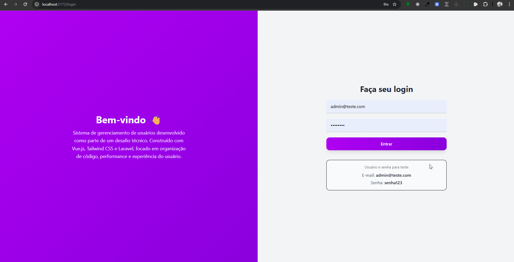
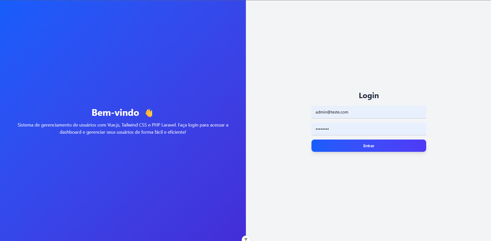
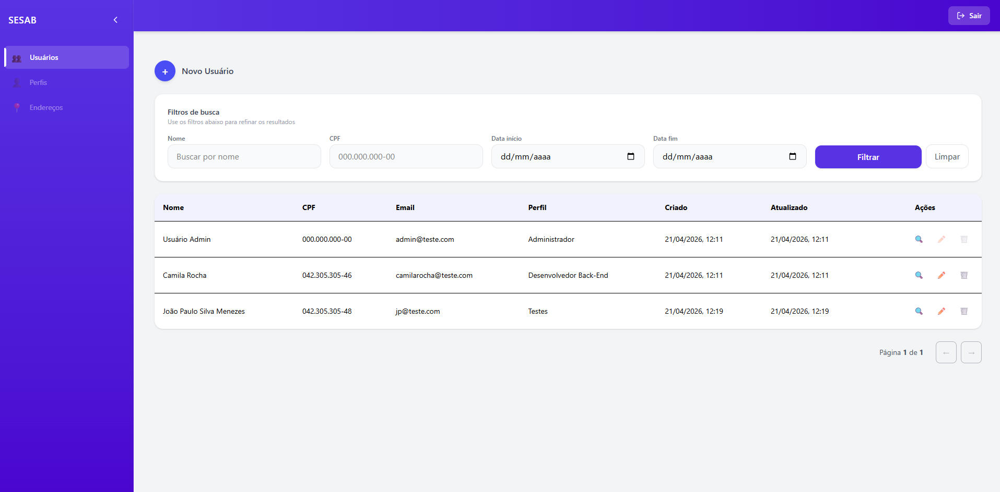
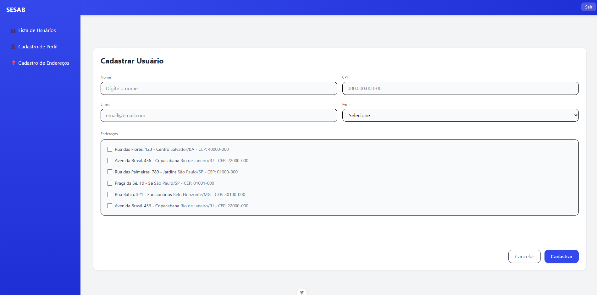
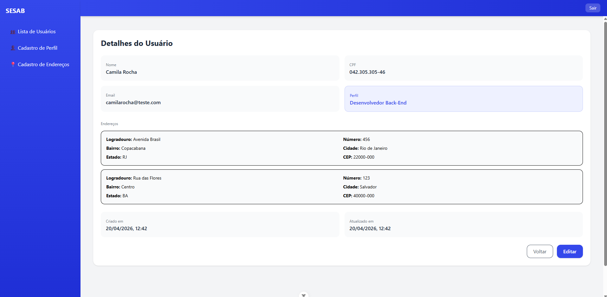
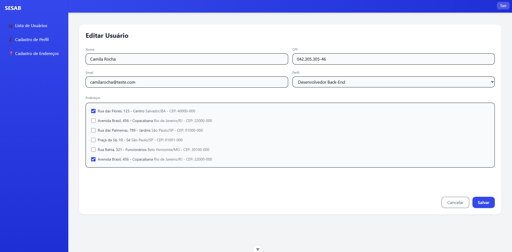
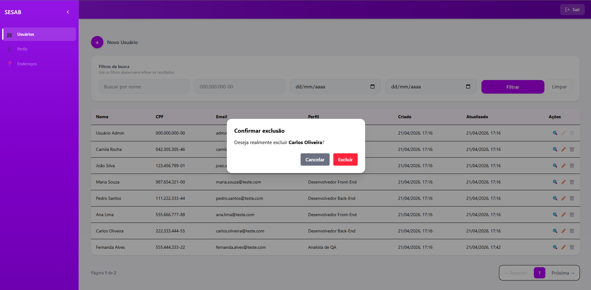

## Objetivo do desafio

Desenvolver uma aplicação frontend moderna com Vue 3, capaz de consumir e manipular dados de uma API, com foco em boas práticas de arquitetura e experiência do usuário.

O sistema inclui:

- Listagem de usuários
- Visualização de detalhes
- Cadastro, edição e remoção
- Estrutura modular e reutilizável de componentes

## Demonstração do Projeto

### Visão geral



### Tela inicial



### Lista de usuários



## Criação de usuário



### Detalhes do usuário



## Edição do usuário



## Exclusão do usuário



---

## ⚙️ Tecnologias utilizadas

- Vue 3
- Vite
- Vue Router
- Axios
- JavaScript
- CSS / Tailwind

---

## Setup do Projeto

### Instalar dependências

```bash
npm install
```

### Rodar a aplicação

```bash
npm run dev
```

### Opcional: Rodar em docker

Docker version 29.4.1
Docker Compose version v5.1.3

```bash
sudo docker compose up --build
```

### 👤 Usuário administrador padrão

Após a inicialização do backend, utilize as seguintes credenciais para acessar a aplicação como administrador:

```
Login: admin@teste.com
Senha: senha123
```

````
## 📁 Estrutura do Projeto

```src/
├── assets/         # Imagens, fontes e outros recursos estáticos
├── components/     # Componentes reutilizáveis
├── views/          # Telas principais da aplicação
├── router/         # Configuração de rotas
├── services/       # Serviços para consumo de API
├── App.vue         # Componente raiz
├── main.js         # Ponto de entrada da aplicação
````

---## 📄 Licença
Este projeto é licenciado sob a [MIT License](LICENSE). Sinta-se à vontade para usar, modificar e distribuir este código conforme necessário.

## 📞 Contato

Se você tiver alguma dúvida ou quiser entrar em contato, sinta-se à vontade para me enviar um email para [contatowesleygm@gmail.com](mailto:contatowesleygm@gmail.com) ou me encontrar no LinkedIn: [linkedin.com/in/wesleyguerra09](https://www.linkedin.com/in/wesleyguerra09/). Estou sempre aberto a conversar sobre tecnologia, desenvolvimento frontend e oportunidades de colaboração!

### Desenvolvido por [Wesley Guerra](https://www.linkedin.com/in/wesleyguerra09/)
